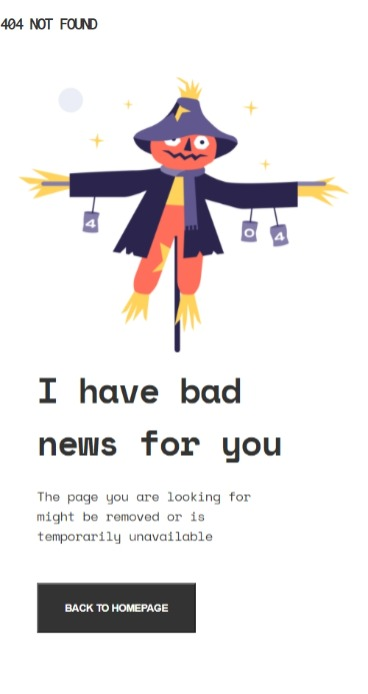

<!-- Please update value in the {}  -->

<h1 align="center">{Devchallenge 404}</h1>

   Solution for a challenge from  <a href="http://devchallenges.io" target="_blank">Devchallenges.io</a>.

  <h3>
    <a href="https://vinaximus.github.io/devchallenge404/">
      Demo
    </a>
     | 
    <a href="https://github.com/vinaximus/devchallenge404.git">
      Solution
    </a>
     | 
    <a href="https://devchallenges.io/challenges/wBunSb7FPrIepJZAg0sY">
      Challenge
    </a>
  </h3>

<!-- TABLE OF CONTENTS -->

## Table of Contents

- [Overview](#overview)
  - [Built With](#built-with)
- [Features](#features)
- [Contact](#contact)
- [Acknowledgements](#acknowledgements)

<!-- OVERVIEW -->

## Overview

### Built With
CSS (Flex), HTML

## Features
   Hoverstate and trnasition for button.
   Responsive
   

This application/site was created as a submission to a [DevChallenges](https://devchallenges.io/challenges) challenge. The [challenge](https://devchallenges.io/challenges/wBunSb7FPrIepJZAg0sY) was to build an application to complete the given user stories.

## Acknowledgements
Special thanks to W3Schools, MDN and UDEMY

## Contact

- GitHub [@vinaximus](https://github.com/vinaximus)
- Twitter [@itwork4u](https://twitter.com/itwork4u)
